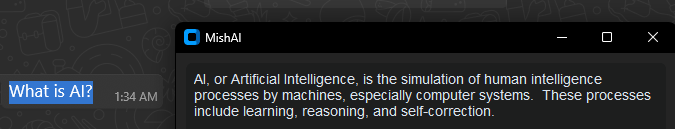

# MishAI

The smart desktop assistant for Windows that instantly answers your questions from selected text or screen regions.

About The Project
Stop context-switching. MishAI is a native Windows assistant that brings Google Gemini & OpenAI GPT to your workflow. Get instant answers from selected text or screen regions via hotkeys, without ever leaving your current app. Boost your productivity with AI at your fingertips.

Insert a GIF here demonstrating the application in action. For example:

🎯 Key Features
Dual Capture Modes:

📰 Text: Instantly analyze any selected text.

🖼️ Screenshot: Select any area on your screen, and the AI will understand what's on it.

Flexible Configuration:

🔧 Fully customizable hotkeys.

🌐 Multi-language support (Russian/English) for both UI and AI responses.

⚙️ Choose your AI provider (Gemini/OpenAI), model, and manage API keys independently through a user-friendly menu.

Smart UX:

🚀 Welcome video on first launch.

📋 Automatically copies the AI's response to the clipboard.

🔒 Prevents multiple instances of the application from running.

🌙 Runs in the background via a system tray icon.

🛠️ Built With
Python 3

CustomTkinter: For creating the modern GUI.

Pystray: For the system tray icon.

Keyboard: For global hotkey management.

MSS: For screen capturing.

OpenCV & ffpyplayer: For splash screen video playback.

PyInstaller & Inno Setup: For building a full-fledged .exe installer.

🚀 Getting Started
To get a local copy up and running, follow these simple steps.

Prerequisites
Python (3.10 or higher)

Git

Installation
Clone the repo:

git clone https://github.com/your_username/MishAI.git

cd MishAI

Create and activate a virtual environment:

python -m venv .venv
.venv\Scripts\activate

Install all dependencies:

pip install -r requirements.txt

Run the application:

python src

On the first launch, the app will ask for your API key and create a configuration file in %AppData%/MishAI.

💻 Usage
To analyze text: Select text anywhere and press Ctrl+Shift+Q (by default).

To analyze a screenshot: Press Ctrl+Shift+S (by default), select a region of your screen, and release the mouse button.

Settings: Right-click the tray icon to open the settings menu, where you can change hotkeys, language, model, and API keys.

📦 Building The Installer
If you want to build your own setup.exe from the source code:

Install Inno Setup: Download and install Inno Setup.

Run the build script:

python build.py

The final installer MishAI-vX.X.X-setup.exe will appear in the installers folder.
