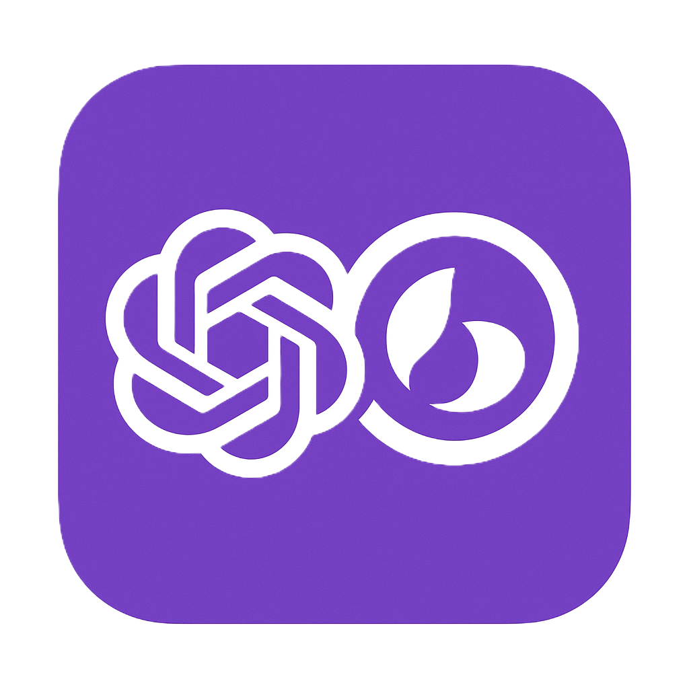

<div align="center">



# MishAI  
### 🖥️ The Smart Desktop Assistant for Windows

[](https://github.com/tipasofteri/MishAI/releases)


</div>

---

## 📖 About the Project

**MishAI** is a lightweight and fast desktop assistant that’s always within reach.  
It lets you instantly get answers from **Google Gemini** or **OpenAI ChatGPT** without leaving your workflow.  
Select text or a screen region, and MishAI will instantly analyze the content and provide a context-aware answer.

💡 Perfect for:
- Code analysis
- Text translation
- Understanding complex screenshots or diagrams
- Quick Q&A without opening a browser

---

## 🎯 Key Features

### 📌 Dual Capture Modes
- **📰 Text Mode** — instantly analyze any selected text.
- **🖼️ Screenshot Mode** — select any area of your screen and let the AI understand it.

### ⚙️ Flexible Configuration
- 🎛️ Fully customizable hotkeys.
- 🌐 Multi-language UI & AI responses (**English / Russian**).
- 🔑 Choose AI provider (**Gemini** or **OpenAI**), model, and manage API keys independently.

### 🧠 Smart UX
- 🎬 Welcome video on first launch.
- 📋 Automatically copies AI responses to clipboard.
- 🚫 Prevents multiple instances from running.
- 🌙 Runs quietly in the background via **system tray icon**.

---

## 🛠️ Built With

- **Python 3**
- [CustomTkinter](https://github.com/TomSchimansky/CustomTkinter) — modern GUI
- [Pystray](https://github.com/moses-palmer/pystray) — tray icon
- [Keyboard](https://github.com/boppreh/keyboard) — hotkeys
- [MSS](https://github.com/BoboTiG/python-mss) — screenshots
- **OpenCV**, **ffpyplayer** — video playback
- **PyInstaller**, **Inno Setup** — `.exe` installer

---

## 🚀 Getting Started

### 📋 Prerequisites
- Python **3.10+**
- Git

### 🔧 Installation
```bash
# Clone the repository
git clone https://github.com/tipasofteri/MishAI.git
cd MishAI

# Create a virtual environment
python -m venv .venv
.venv\Scripts\activate

# Install dependencies
pip install -r requirements.txt

# Run the application
python src
```

💻 Usage
On first launch, you’ll be prompted to enter your API key.
```bash
#Settings are saved 
%AppData%/MishAI
```

Action	Default Hotkey
📰 Analyze selected text	Ctrl+Shift+Q
🖼️ Analyze screenshot	Ctrl+Shift+S

✪ Settings: Right-click the tray icon → open settings menu

✪ You can change the language, AI model, and hotkeys

<div align="center">  </div>

📦 Building the Installer

1.Install Inno Setup

2.Run:

```bash
python build.py
```
The installer will appear in the installers folder:
```bash
MishAI-vX.X.X-setup.exe
```

📜 License
This project is licensed under the MIT License.
You are free to use, modify, and distribute it.

<div align="center">
⭐ If you like this project, give it a star on GitHub! ⭐

</div> 
